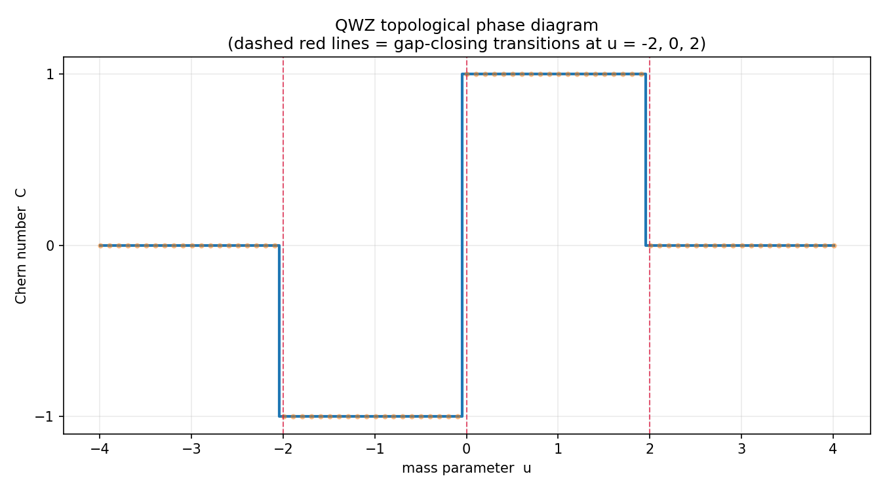
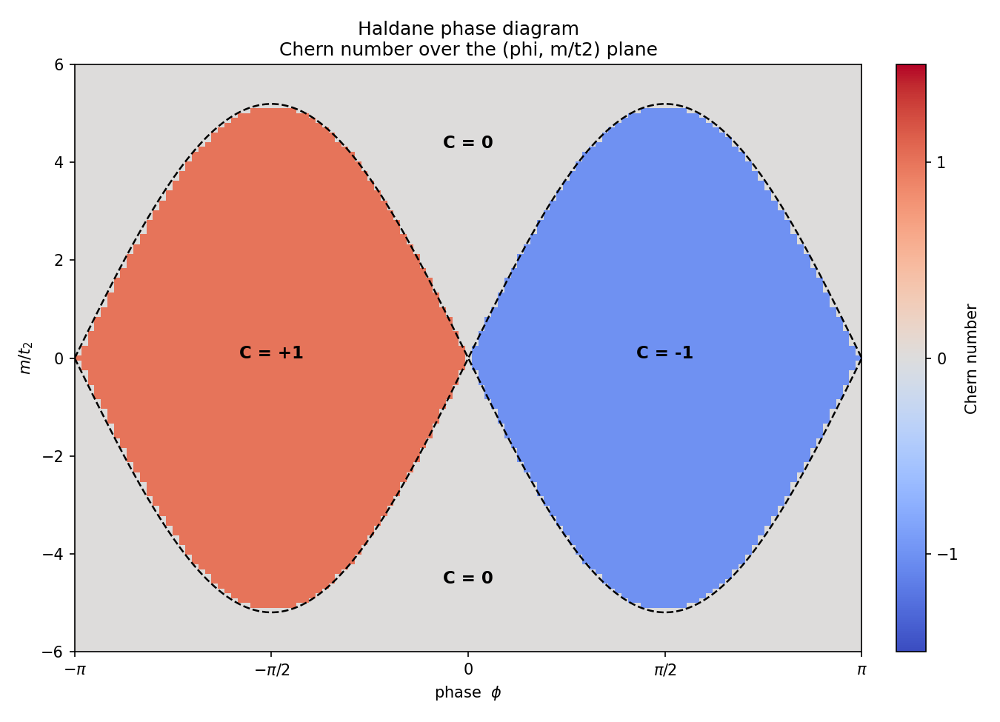

# Topological Band Structure & Chern Number Calculator

A from-scratch computation of the **Chern number**, the integer that classifies
topological insulators, built on two lattice models that share one topology
engine:

- **Qi-Wu-Zhang (QWZ)** — the simplest Chern insulator, on a square lattice.
- **Haldane** — the honeycomb-lattice model that founded the field.

The headline idea: a continuous knob (a mass, or a hopping phase) produces a
**quantized integer** response (the Chern number), and that integer only changes
when the band gap closes. Every result here is self-verifying, because the Chern
number must come out as an exact integer.




---

## 0. What you need

**Software:** Linux, macOS, or Windows (WSL is fine); Python 3.9+; two packages,
`numpy` and `matplotlib`.

**Knowledge (you have most of this as a chemistry major):** linear algebra
(eigenvalues/eigenvectors — NumPy does the diagonalizing), multivariable calculus
(the *concepts* of gradient, curl, and a surface integral), and quantum mechanics
at the level of Hermitian operators and energy eigenstates. No prior
condensed-matter or topology coursework is assumed; the physics is explained in
the module docstrings and in section 5.

New here? Read **GETTING_STARTED.md** first — it is a click-by-click guide that
assumes no terminal experience.

---

## 1. One-time setup

```bash
cd chern-calculator
python -m venv .venv                 # optional but recommended
source .venv/bin/activate            # Windows: .venv\Scripts\activate
pip install -r requirements.txt
```

If you skip the virtual environment, just run
`python -m pip install numpy matplotlib` and continue.

---

## 2. Run it

Always run from the project root. Use `python3` if `python` is not found.

```bash
python test_models.py            # proves BOTH models are correct (all PASS)

# --- QWZ (square lattice) ---
python run_bands.py              # band structure -> figures/bands.png
python run_chern.py              # Chern number + Berry curvature map
python run_phase_diagram.py      # the C-vs-u staircase (headline QWZ result)
python explore.py                # interactive: drag the mass slider

# --- Haldane (honeycomb lattice) ---
python run_haldane.py            # bands + the famous 2D phase diagram
python explore_haldane.py        # interactive: sliders for m, phi, t2
python run_edge_states.py        # bulk-boundary correspondence: edge modes
```

Figures are written to `figures/`.

---

## 3. Project layout

```
chern-calculator/
├── README.md
├── GETTING_STARTED.md            <- start here if terminals are new to you
├── requirements.txt
│
├── topo/                         <- the library
│   ├── __init__.py
│   ├── models.py                 <- QWZ and Haldane Hamiltonians, energies, geometry
│   ├── berry.py                  <- model-agnostic Chern engine (FHS method)
│   └── ribbon.py                 <- Haldane ribbon for edge states (bulk-boundary)
│
├── run_bands.py                  <- QWZ bands
├── run_chern.py                  <- QWZ Chern + Berry curvature
├── run_phase_diagram.py          <- QWZ phase diagram
├── explore.py                    <- QWZ interactive dashboard
│
├── run_haldane.py                <- Haldane bands + 2D phase diagram
├── explore_haldane.py            <- Haldane interactive dashboard
├── run_edge_states.py            <- edge modes + bulk-boundary correspondence
│
└── test_models.py                <- correctness checks for both models
```

Read the library in this order: `topo/models.py` (the physics), then
`topo/berry.py` (the topology). Each opens with a plain-language docstring.

The design worth noticing: `berry.py` never imports a specific model. It takes a
Hamiltonian already evaluated on a grid and returns the Chern number. Both models
plug into the same engine — the topology machinery is universal, only the
Hamiltonian changes.

---

## 4. Suggested path through it

1. **Setup** — section 1, then `python test_models.py`, confirm all PASS.
2. **QWZ bands** — read `topo/models.py` (QWZ part), run `run_bands.py`, explain
   why the gap closes at u = -2.
3. **QWZ Chern** — read `topo/berry.py` including the gauge-problem docstring, run
   `run_chern.py`, confirm integers, study the curvature heatmap.
4. **QWZ phase diagram** — run `run_phase_diagram.py`; this is the QWZ headline.
5. **Play** — `python explore.py`, drag the slider across u = -2, 0, 2.
6. **Haldane** — read the Haldane part of `models.py`, run `run_haldane.py`.
   Study how, at the transition, the gap closes at only one Dirac point.
7. **Play** — `python explore_haldane.py`; drag across the phase boundaries and
   watch the Chern number jump.
8. **Edges** — `python run_edge_states.py`. This is the physical payoff: it shows
   that a topological ribbon carries conducting edge channels bridging the gap,
   and that their number equals the bulk Chern number. Compare to the trivial
   ribbon's clean gap.

---

## 5. The physics and math, briefly

**Two-band models.** Each Bloch Hamiltonian is a 2x2 Hermitian matrix
`H(k) = eps(k) I + d(k) . sigma`. The `eps I` term shifts energies but not
eigenvectors, so all topology lives in the vector field `d(k)`.

- **QWZ:** `d = (sin kx, sin ky, u + cos kx + cos ky)`. Gap closes at u = -2, 0, 2.
- **Haldane:** nearest-neighbor hopping `t1` makes graphene's Dirac cones; a
  complex next-nearest-neighbor hopping `t2 e^{i phi}` breaks time-reversal
  symmetry; a staggered mass `m` breaks inversion symmetry. The gap at the two
  Dirac points K, K' is set by `m_K = m - 3 sqrt3 t2 sin phi` and
  `m_Kp = m + 3 sqrt3 t2 sin phi`. Opposite signs -> topological; same sign ->
  trivial. Boundaries: `m = +/- 3 sqrt3 t2 sin phi`.

**Where the multivariable calculus is.** Each eigenstate carries a Berry
connection `A(k) = i <u|grad_k|u>` (a gradient), a Berry curvature
`Omega = curl A` (a curl), and a Chern number
`C = (1/2pi) integral_BZ Omega d^2k` (a surface integral) that is guaranteed to
be an integer.

**Why we don't differentiate directly.** A numerical eigensolver returns
eigenvectors with random phases, wrecking the gradient. The
**Fukui-Hatsugai-Suzuki** method rewrites the integral with overlaps between
neighboring k-points so the phases cancel and the result is an integer
automatically. That is the core of `topo/berry.py`.

**Bulk-boundary correspondence.** The Chern number is a bulk quantity, but it
dictates edge behavior: a ribbon of a Chern insulator carries exactly |C|
one-way conducting channels on each edge, with direction set by the sign of C.
`topo/ribbon.py` builds the Haldane model on a finite-width strip and
`run_edge_states.py` confirms the number of gap-crossing edge bands equals 2|C|,
one set per edge, each verified to be edge-localized.

**One subtlety the code gets right.** The honeycomb Brillouin zone is a hexagon,
not the square used for QWZ, so the Haldane calculation samples the actual
reciprocal lattice (`honeycomb_grid`). Sampling the wrong region gives a wrong,
non-unit Chern number even with a correct Hamiltonian.

---

## 6. Ways to extend it

1. **Convergence study** — plot Chern-number error vs grid size.
2. **Anomalous Hall conductivity** — `sigma_xy = C e^2/h`, connecting the integer
   to a measurable quantity.
3. **A third model** — add the BHZ model (a Z2 topological insulator) on the same
   engine to move from Chern to time-reversal-invariant topology.
4. **Disorder** — add random on-site energies to the ribbon and show the edge
   channels survive while bulk states localize (topological protection).
5. **Performance/UX** — a convergence animation, or an interactive edge-state
   visualizer with the wavefunction updating as you drag k.

---

## 7. How to present this

Lead a short writeup with the two phase diagrams. Structure: the question (what a
Chern number is and why it is quantized) -> the models -> the gauge problem and
the FHS fix -> results (the figures) -> validation (integer outputs + the test
suite) -> extensions. Emphasize what you built yourself, that one engine handles
both lattices, and that the results match the known phase boundaries exactly.

---

## 8. References

- Qi, Wu, Zhang, *Phys. Rev. B* **74**, 085308 (2006) — the QWZ two-band model.
- Haldane, *Phys. Rev. Lett.* **61**, 2015 (1988) — the honeycomb model.
- Fukui, Hatsugai, Suzuki, *J. Phys. Soc. Jpn.* **74**, 1674 (2005) — the
  discrete Chern-number method used in `berry.py`.
- Bernevig & Hughes, *Topological Insulators and Topological Superconductors*
  (Princeton, 2013) — the standard textbook.
